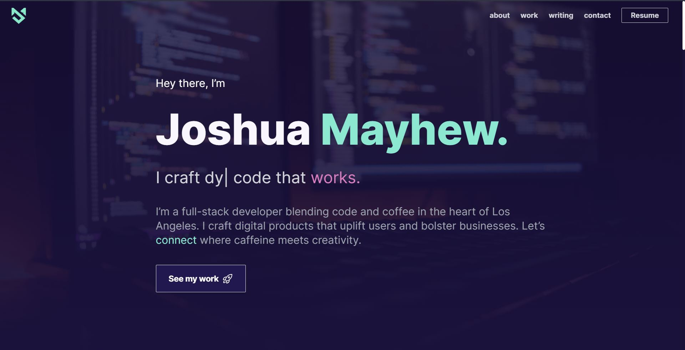

# Joshua Mayhew's Personal Portfolio

A hub where I blend code and coffee to craft captivating digital experiences.

## 🚀 Overview

My portfolio showcases various facets of my developer journey and expertise:

- **Hero**: A captivating introduction reflecting my identity as a developer.
- **About**: Delving into my transition from paralegal to programmer and the skills I've honed.
- **Work**: A selection of my notable projects, emphasizing my versatility as a full-stack developer.
- **Writing**: Insights, tutorials, and thoughts shared through my written articles.
- **Contact**: An open invitation to connect, collaborate, and caffeinate.

## 🎨 Design Philosophy

Inspired by Brittany Chiang's design patterns, I embraced a fusion of minimalism and vibrancy. The objective is to provide visitors with a clear insight into my professional capabilities, underscored by the passion I pour into all of my projects.

## 🛠️ Tech Stack

- **React.js/Next.js**: Leveraging powerful features such as server-side rendering and static site generation to enhance both performance and user experience.

- **TailwindCSS/DaisyUI**: Utilizing a utility-first approach for swift UI development while maintaining design flexibility.

## 🙏 Acknowledgments

A heartfelt nod to Brittany Chiang for her inspiring designs. Immense gratitude also goes to the open-source community for the invaluable resources that guided my development journey.

## 📜 License

© 2023 Joshua Mayhew. All rights reserved. Unauthorized reproduction, duplication, or distribution of the content is strictly prohibited.
